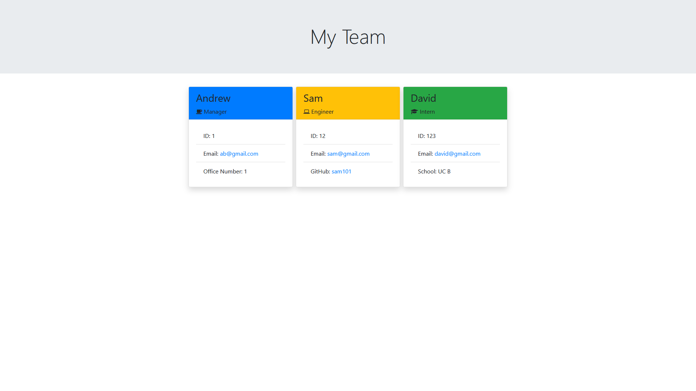

## Team Profile Generator

(https://youtu.be/VAuRl4jvOwE)

# Description

The team generator helps put in data that will allow you to store coworkers' IDs, Emails, Github, schools, and many more. The cards are color-coded depending on what their role is in the company. Let's say you're a contractor, or if you're trying to remember which department they belong to. With this tracker, an ID, email or github will allow you to see a card associated with them. By color-coding the roles, you know who's supposed to be doing what without having to check what department they are in.

## Installation

To install necessary dependencies, run the following command:

```
npm i inquirer jest
```

## Tests

To run tests, run the following command:

```
node index.js
```

## Questions

If you have any questions about the repo, open an issue or contact me directly at andrewbanagas40@gmail.com. You can find more of my work at [drew990](https://github.com/drew990/)

# Author

Andrew Banagas
